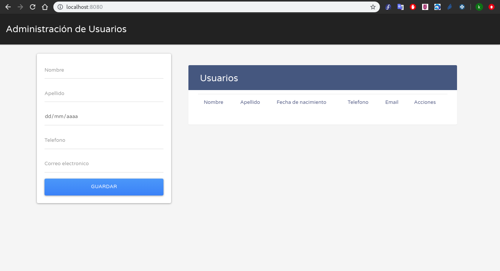
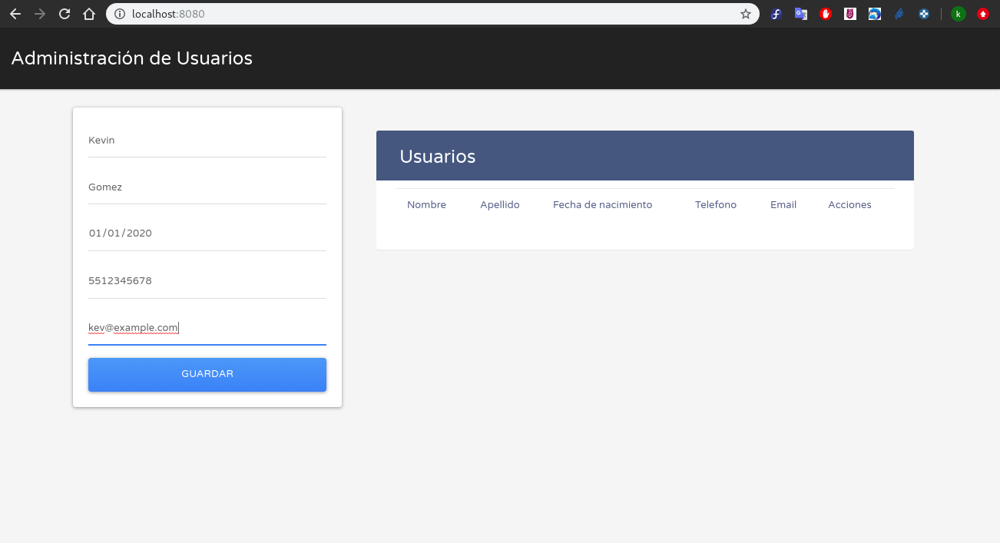
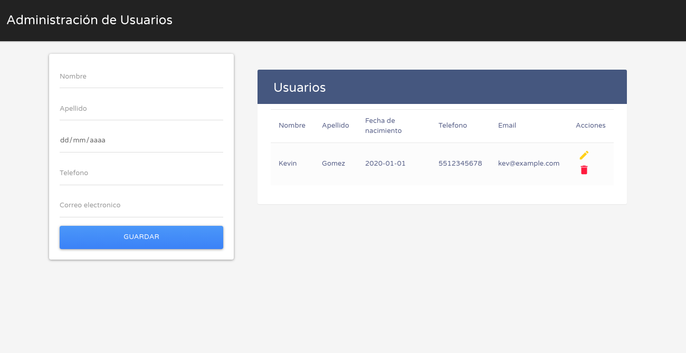
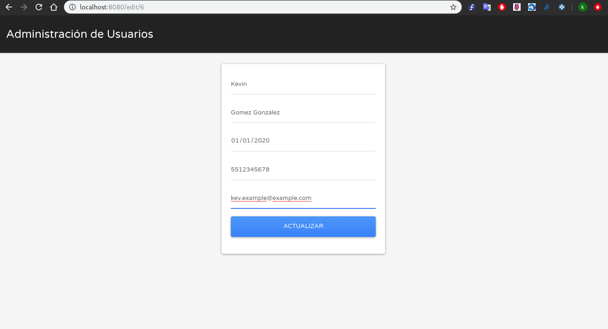

# Sistema CRUD TT-2021-009

El objetivo de este sistema es ejemplificar la construccion de uno de los componentes de una aplicacion, en este caso un pequeño CRUD, por de medio de herramientas como Jenkins y Docker haciendo uso de tecnicas como la Integración y Entrega Continua.

## Estructura del repositorio.

El repositorio se encuentra conformado por la siguiente estructura de archivos y directorios.

```
├── docker-entrypoint.sh
├── Dockerfile
├── README.md
├── requirements.txt
└── src
    ├── Crud.py
    ├── EnviromentMysqlVariables.py
    ├── main.py
    ├── ManageDatabase.py
    ├── static
    │   ├── css
    │   │   ├── bootstrap
    │   │   │   ├── bootstrap.min.css
    │   │   │   └── font-awesome.min.css
    │   │   ├── estilos.css
    │   │   └── fonts
    │   │       ├── fontRoboto.css
    │   │       └── icon.css
    │   ├── images
    │   │   └── iconoInfra.png
    │   └── js
    │       ├── bootstrap
    │       │   └── bootstrap.min.js
    │       ├── jquery
    │       │   └── jquery-3.3.1.slim.min.js
    │       ├── main.js
    │       └── popper.min.js
    ├── templates
    │   ├── edit-user.html
    │   ├── index.html
    │   └── layout.html
    └── User.py 
```

Importante señalar que el directorio **src** contiene todo el código separando los archivos correspondientes al front en dos subdirectorios **static** y **templates** los archivos backend corresponden a los archivos con terminacion **.py** donde **main.py** hace referencia al archivo principal.

## Tecnologías

* Python
  * Flask
  * SQLAlchemy
  * uWSGI
* Html5
* Mysql / Mariadb
* Docker

## Despliegue

### Creación de imagen Docker

Dentro de este repositorio se pone a disposición el archivo [Dockerfile](Dockerfile) para el proceso de construcción de la imagen, el cual se encuentra basado en [Las buenas practicas](https://docs.docker.com/develop/develop-images/dockerfile_best-practices/) que Docker ha puesto a disposicion en su documentación oficial.

Para construir la imagen:

```bash
docker build -t tt-2021-crud .
```

### Despliegue del CRUD

Previo al despliegue de la imagen CRUD es preciso levantar una instancia de mysql/mariadb para el almacenamiento de toda la data.

```bash
MYSQL_CONTAINER="mysql"
MYSQL_ROOT_PASSWORD="Einaizoh1Eiyeighahr2aiv5F"
MYSQL_DATABASE="tt-db"
MYSQL_USER="tt-user"
MYSQL_PASSWORD="Leiciengabeephoh0phohh2ee"
MYSQL_PORT="3306"

mkdir -p /var/containers/$MYSQL_CONTAINER/{var/lib/mysql,var/log/mysql/,var/tmp/mysql/}
chown 999:999 -R /var/containers/$MYSQL_CONTAINER

docker run -itd --name $MYSQL_CONTAINER \
    -p $MYSQL_PORT:$MYSQL_PORT \
    --restart unless-stopped \
    -v /var/containers/$MYSQL_CONTAINER/var/lib/mysql/:/var/lib/mysql:z \
    -v /var/containers/$MYSQL_CONTAINER/var/log/mysql/:/var/log/mysql/:z \
    -v /var/containers/$MYSQL_CONTAINER/var/tmp/mysql/:/var/tmp/mysql/:z \
    -v /etc/localtime:/etc/localtime:ro \
    -e "MYSQL_ROOT_PASSWORD=$MYSQL_ROOT_PASSWORD" \
    -e "MYSQL_DATABASE=$MYSQL_DATABASE" \
    -e "MYSQL_USER=$MYSQL_USER" \
    -e "MYSQL_PASSWORD=$MYSQL_PASSWORD" \
    mariadb
```

Seguido de ello llevamos a cabo el despliegue de la aplicación CRUD.

```bash
TT_CONTAINER="tt-crud"
TT_DBDATABASE="tt-db"
TT_DBHOST="172.18.0.2"
TT_DBPORT="3306"
TT_DBUSER="tt-user"
TT_DBPASSWORD="Leiciengabeephoh0phohh2ee"
TT_PORT="8080"

docker run -itd --name $TT_CONTAINER \
    --restart unless-stopped \
    -p $TT_PORT:$TT_PORT \
    -v /etc/localtime:/etc/localtime:ro \
    -e "TT_PORT=$TT_PORT" \
    -e "TT_DBDATABASE=$TT_DBDATABASE" \
    -e "TT_DBHOST=$TT_DBHOST" \
    -e "TT_DBPORT=$TT_DBPORT" \
    -e "TT_DBUSER=$TT_DBUSER" \
    -e "TT_DBPASSWORD=$TT_DBPASSWORD" \
    tt-2021-crud
```

Consultar http://localhost:8080/

## Capturas





